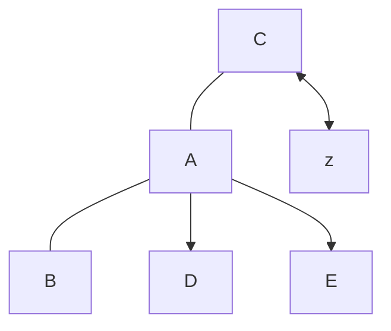
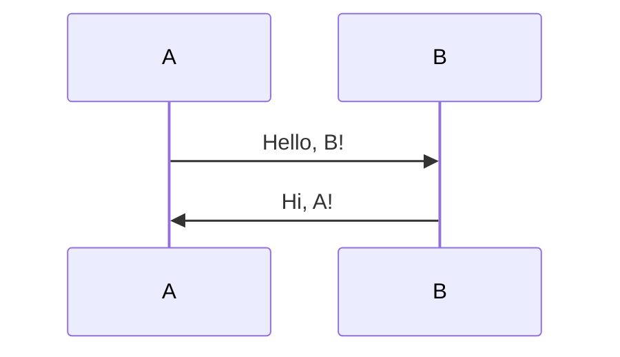
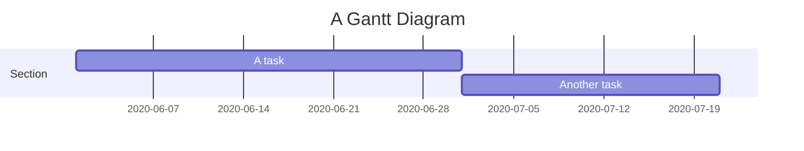
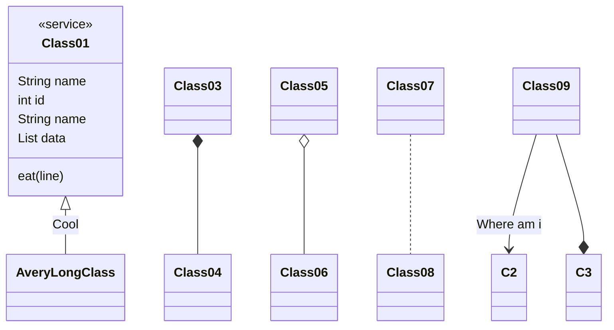
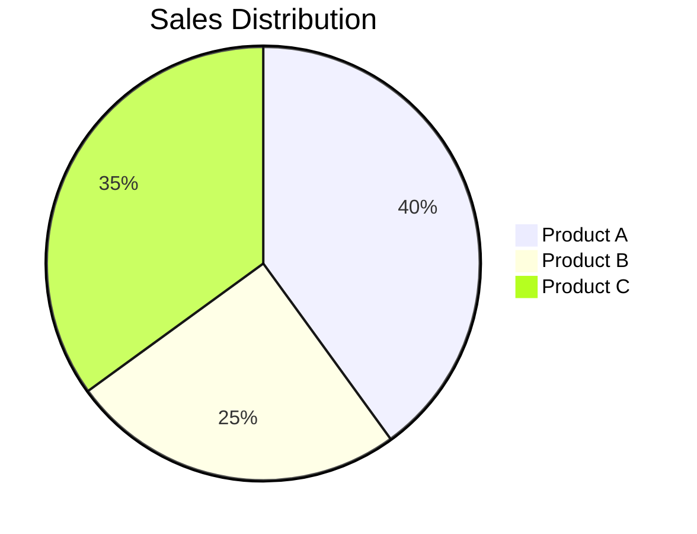

# markdown

### vanilla markdown

**bold**

*itlicized*

> blockquote

`code`

---

[link](https://youtube.com)

here's  simple footnote, [^1] 

[^bignote]

[^1]: This is the first foot note

[^bignote]: here's one with multiple paragraphs nd code

    Indent paragraphs to include them in the foot note.

    `{ my code }`

### Mermaid markdown

**\# flowchart**

**\# sequence diagram**

**\# gantt chart**

**\# class diagram**

**\#Pie chart**

