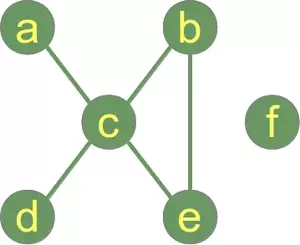

# Graph Theory

### About Graph

- node: as known as 'vertices'. like a, b, c the entitiies.
- edge: line between node. if it has direction, directed graph or un- one. in addition directed edge called 'arc'
- 