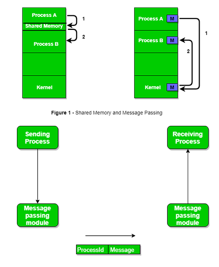

# IPC: Inter Process Communication

### about

- An Independent process is not affected by the execution of other processes, while a co-operating process can be affected by other executing processes.
- Independent process is more effective we may think, but many situations increasing computational speed.
- IPC is a mechanism that allows processes to communicate with each other and synchronize their actions.

### concept

\# main idea

- The communication between these processes can be seen as a method of co-operation between them.
  - Shared Memory
  - Message passing

\# types of process

- Independent process
- Co-operating process

### logic

\# shared memory method

- There are two processes: Producer and Consumer.
- The two processes share a common space or memory location known as a buffer. When consumer consumes the item if they needed.
  - Two problem exist on this process
    - Unbounded buffer problem  : Producer can keep on producing items and there is no limit on the size of the buffer
    - Bounded buffer problem    : Producer can produce up to a certain items before it start waiting for consumer to sonsume it. latency problem
- javascript code: [code](../../../Language/Javascript/node/concept/producer_consumer.js)

\# messaging passing method

- This method processes communicate with each other without using any kind of shared memory.
- If process p1 and p2 want to communicate, then proceed follows below constraint
  - Establish a communication link
  - Start exchanging msg using basic primitives: send(msg, destination), receive(msg, host)
- The msg size fixed or flexible. When the msg size is flexible, that things makes programmer easy OS designer hard, fix reverse.
- A standard msg can have two parts, header is used for storing msg type destination, control info, etc meta data.
- The control info contains buffer space, sequnce number, priority ...
- Generally, message is sent using FIFO style.

**implement point**

- How are links established?
- Can a link be associated with more than two processes?
- How many links can there be between every pair of communicating processes?
- what is the capacity of a link? is the size of a msg that the link can accommodate fixed or variable?
- Is a link unidirectional or bi-directional?

**link capacity**

- A link has some capacity that determines the number of messages 
- Every link has a queue associated with it which can be of zero capacity, bounded capacity, unbounded capacity.
- In zero capa sender waits until the receiver informs the sender about msg, non-zero case sender must anounce about receive msg.

**Communication type**

1. Direct Communication links : implemented when the processes use a specific identifier for the communication, but its hard
2. In-direct Communication    : This is done via a shared mailbox (port), which consists of a queue of msg. sender keeps receiver pick up

\# message passing through exchanging the messages

**Synchronous and Asynchronous Message passing**

- IPC is possible betw the processes on same computer as well as on the processes running on different computer
- Blocking is considered synchronous and blocking send means the sender will be blocked until msg received by receiver.
- Similarly, blocking receive has the receiver block until a msg is available.
- Non blocking is considered asynchronous and Non blocking send has the sender sends the msg and continue.