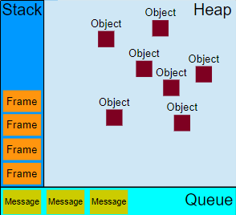

# Javascript

### runtime model

- based on an 'event loop'. which responsible for executing the code, collecting and processing events, and executing queued sub-tasks.

- runtime concept: Modern JavaScript engines implement and heavily optimize the described semantics.

