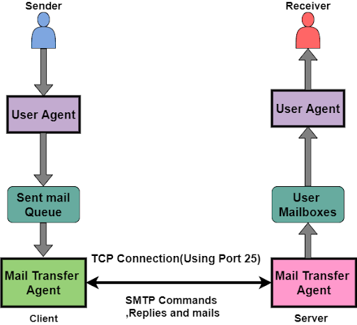

# SMTP: Simple Mail Transfer Protocol

### about

\# image

 

\# general info

- SMTP is an Internet standard communication protocol for electronic mail transmission.
- The protocol version in common use today has extensible structure with various extensions for authenticatiion, encryption, binary data transfer, internationalized.
- SMTP servers commonly use the Transmission Control Protocol on port number 25(plaintext) and 587 (encrypted communications), 456.
- SMTP allows computers and servers to exchange data regardless of their underlying hardware on software.
- SMTP is a mail delivery protocol, not a mail retrieval protocol.

\# SMTP server

- SMTP server is a mail server that can send and receive emails using the SMTP protocol.
- Mail Submission Agent(MAS)  : The MSA receives emails from the email client.
- Mail Transfer Agent(MTA)    : The MTA transfers emails to the next server in the delivery chain.
- Mail Delivery Agent(MDA)    : The MDA receives emails from MTAs and stores them in the recipient's email inbox.

### mail sequence

1. SMTP connection opened
2. Email data transferred
3. Mail Transfer Agent(MTA)
4. Connection closed

### terms

- envelope: Set of information that the email client sends the mail server about where the email comes from and where it is going.

### Error

\# code: 535

- related with incorrecting authentication data
- 535 is response code signaling authentication issues during email sending.
- Common causes 
  - incorrect login credentials
  - server configuration issues
  - overly stric security settings and firewalls
- Diagnosis and Solutions
  - Identify the error through messages
  - Verify and correct login credentials, check server configurations, and adjust security settings