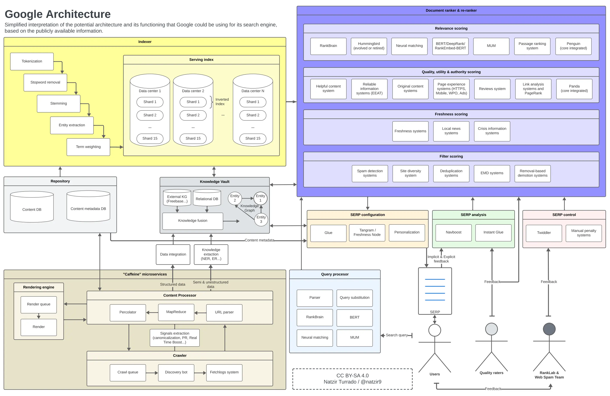

# google serch engine

> quote: https://www.analistaseo.es/posicionamiento-buscadores/how-google-works-working-algorithms/

### pmp points

- search-click related values records and use for making products.

### conclusion

- Within docs we can find the click is the critical elements of search system.
- Combination click and human evaluators makes google search engine more better.
- Chrome is also critical component for digital dominance.

### algorithm

1. Understand the query
2. Determine relevance
3. Prioritize freshness
4. Personalize results

### evaluate search quality

1. IS(Information Statisfaction score ranging from 0 to 100) score

- Derived from the evaluators ratings and used as a primary indicator of quality in google.
- This evalutated anonymously and do not know they evaluate themselves.
- This IS scores percieve the quality and train various models within Google's search system including classification algorithms like RankBran and Rank embeded BERT.
- This consider a broader range of metric and factors.

\# Limitations of human evaluators.

1. Temporal mismatches
2. Reusing evaluations
3. Understanding technical queries
4. evaluating popularity
5. diversity of evaluators
6. User-generated content
7. Freshness Node Training
8. Page Quality

- Google allocate the rater who make the rates on specified site.

3. Side-by-Side

- This tool probably refers to test, place the two searched results and compare each other.

4. Live Experiments

- Google conducts experiments with real traffic to test how people interact with a new feature before rolling it out to everyone.
- They activate the feature for a small percentage of users and compare their behavior with a control group that does not have the feature.
- Measuring the time spent on the page, and consider the duration of clicks and their position on the result page.

5. Freshness

- Freshness is a crucial aspect of both results and search features.
- It is essential to show relevant info as soon as it is available and stop showing content when it becomes outdated.
- There is a risk that very fresh content will have its relevance underestimated and, conversely, that content with a lot of evidence of relevance will become less relevant due to a change in the meaning of the query.
- The role of the freshness node is to add corrections to outdated scores, For queries seeking fresh content degrades outdated content.

\# Detect the freshness site method

1. Correlated NGrams

- These are groups of words that appear together in a statistically significant pattern.
- The correlation can suddenly increase during an event or trenbding topic, indicating a spike.

2. Correlated sailent terms

- These are standout terms that are closely associated with a topic or event
- These frequency of occurrence increases in documents over a shot period, suggesting a spike in interest or related activity.

\# When spikes are detected, the following freshness metrics could be being used

1. Unigrams: RTW

- For each document, the title, anchor texts, and the first 400 characters of the main text are used.
- These are broken down into unigrams relevant to trend detection and are added to the hivemind index.
- The main text generally contains the main content of the article, excluding repetitive or common elements (boilerplate).

2. Half hours since epoch: TEHH

- This is a measure of time expressed as the number of half-hours since the start of unix time.
- This helps establish when something happended with half-hour accuracy.

3. Knowledge Graph Entities: RTKG

- References to objects in Google's knowledge Graph, which is a database of real entities(people, places, things) and their interconnections.
- This helps to enrich search with semantic understanding and context.

4. S2 Cells: S2

- References to objects in google's knowledge graph, which is a database of real entities (people, places, things) and their interconnections. It helps enrich with semantic understanding and context.

5. Freshbox Article Score:RTF

- These are geometric divisions of the Earth's surface used for geographic indexing in+ maps. 
- They facilitate the association of web content with precise geographical locations.

6. Decument NSR: RTN

- This could refer to the News Relevance of the Document and appears to be a metric that determines how relevant and reliable a document is in relation to current stories to trending events.
- This metric can also help filter out low-quality or spam content, ensuring that the documents indexed and highlighted are of high quality and significant for real-time searches.

7. Geographical dimensions

- Features that define the geographical location of an event or topic mentioned in the document.
- These can include coordinates, place names, or identifiers such as S2 cells.

### Click on google

- From user click, the google metric continuously learning.

\# RankLab

- This is a laboratory that tests different weights in signals and ranking factors, as well as their subsequent impact.
- They might also be responsible for the internal tool Twidder.
  - purpose of manually modifying the IR-scores of certain results.
- This reveals complex patterns and allows learning of second and third-order effects.
  - Second-order effects 
    - reflect emerging patterns
    - If the majority prefer and choose detailed articles over quick lists, google detects it.
    - Over time, it adjusts its algorithms to prioritize those more detailed articles in related searches.
  - Third-order effects
    - This is broader, long-term changes
    - If click trends favor comprehensive guides, content creators adapt.
    - They start producing more detailed articles and fewer lists, thus changing the nature of content available on the web.

- From this analysis google identified a discrepancy in various info from clicks.
- This discovery highlights the importance of user clicks as a valuable tool for discerning hidden relevance in large volumes of data.

### google's Architecture

### google's effort to be a default search engine

- Chrome is not just a browser, but a key piece in google's search dominance puzzle.
- Google use behavioral biases like like status quo and loss aversion to make users to lean towards mainitaining google's default.
- When people use chrome, then percentage of using google engine is higher than not.
- To make google as an hompage on browser makes significantly help to occupy much on market share.

### Tech

\# Navboost

- collects data on how users interact with - search results specifically through their clicks on different queries.
- This system tabulates clicks and uses algorithms that learn from human-made quality ratings to improve the ranking of results.
- Differntiates between phone, PC and considers location.
- Records a click data from querioes.

**conclusion** Making qualified data.

\# RankBrain

- This is a Google AI and machine learning system, essential in processing search results.
- This uses Tensor Processing Unit to enhance its processing capability and enrgy efficiency.
- This continually improves its ability to understand language and the intentions behind searches and particularly effective in interpreting ambiguous or complex queries.
- QBST and Term Weighting are components of RanBrain.
  - QBST(Query Based Salient Terms)
    - QBST focuses on the most important terms within a query and related documents, using this information to influence how results are ranked.
  - Term Weighting
    - Adjusts the relative importance of individual terms within a query, based on how users interact with search results.\
    - This helps determine how relevant certain terms are in teh context of the query.

**conclusion** Make accurately results with terms.

\# DeepRank
  
- DeepRank is the internal name for BERT
- By pre-training on large amount of document and adjusting with human feedback, DeepRank can fine-tune search results to be more intuitive and relevant to qualified result.

**conclusion** Understand more on query

\# RankEmbed & RankEmbed-BERT

#### RankEmbed

- RankEmbed focuses on the task of embedding relevant features for ranking.
- This assumed that handled by deep learning system to improve google's search classification process.

#### RankEmbed-BERT

- This is enhanced version of RankedEmbed, integrating the algorithm and structure of BERT.
- This integration was carried out to significantly improve Rankembed's language comprehension capabilities.
- This trained after retrieve the data.

**conclusion** Setting about ranking score

\# MUM

- It's approximately 1,000 times more powerful than BERT and represents a major advancement in google's search.
- Good performance makes from MUM but complexity of logic makes this module used selectively.

**conclusion** Good performance to make natural languages, high complexity.

\# Tangram & Glue

- All these systems work together within the framework of Tangram, which is responsible for assembling the SERP with data from Glue.
- This is not just a matter of ranking results, but organizing them in a way that is useful and accessible to users, considering elements like image carousels, direct answers, and other non textual elements.
  - Tangram: Assembles the SERP by organizaing elements such as web results, carousels, and snippets.
  - Glue: Generalization and extension of Navboost. Unified model of user interaction signals for all types of search results.
  
**conclusion** Integrates the results and make SERP:Searching Engine Result Page

\# Freshness node & Instant Glue

- Giving more weight to recent information, which is especially crucial in searches about news or current events.

### summary

- Navboost: collect data with search result.
- RankBrain: AI machine learning system, it train with user's search result.
  - QBST: focuses on the most important terms within a query and related documents, make a good result for ambiguous and complex query
  - Term Weighting: Make a decision for the relative importance each terms within a query, based on search engine's db term's are rare or often occurs and making balance.

### specification

- SEO: Search Engine Optimization