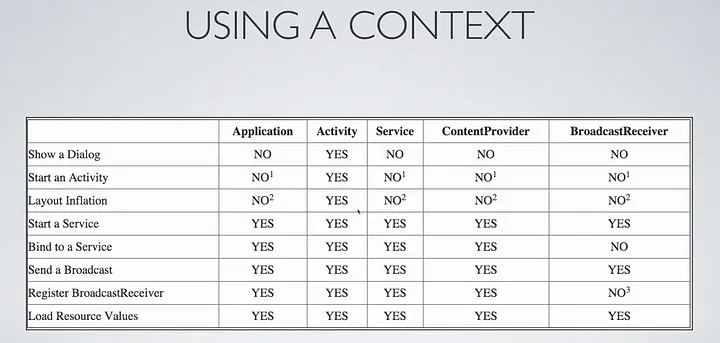

# context

``` usage
Intent intent = new Intent(context_el, target);
```

### about

- interface that contain global information about application environment
- allows to access application-specific resources(strings, themes, assets etc) and classes
- likewise, it deals with application-level operations such as launching activities, broadcasting and receiving intents
- represents a handle to get environment data
- provides the background or setting in which communication occurs. It includes information about the situation, the participants involved, their relationshipm and any relevant past events.
- understanding the context helps in interpreting the meaning of messages accurately.
- for example, if you talk with friend context helps determine the appropriate tone, language, and content.

<details><sumamry>using a context</summary>


</details>

### type 

\# can be input in context_el

1. Application context
- this type of context is directly related with life cycle of app. you can access it via getApplicationContext()

2. Activity
- this related with lifecycle of an activity. you can access it via getContext()

3. Service

4. Application

5. BroadcastReceiver

6. Fragment

### remarks

- can assign context type, 
<details><summary>assign context</summary>

```
public class CustomClass {
    private Context mContext;

    publci CustomClass(Context context){
        this.mContext = context;
    }
}
```

</details>
